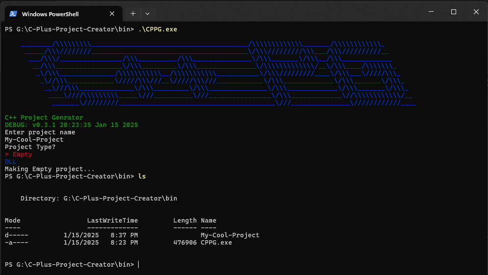

# C-Plus-Project-Creator
Simple command-line tool for creating c++ projects with full folder structure and makefile.

## Build Status

- **Linux**: 
- **Windows**: 
- **macOS**: 

Example Screenshot

